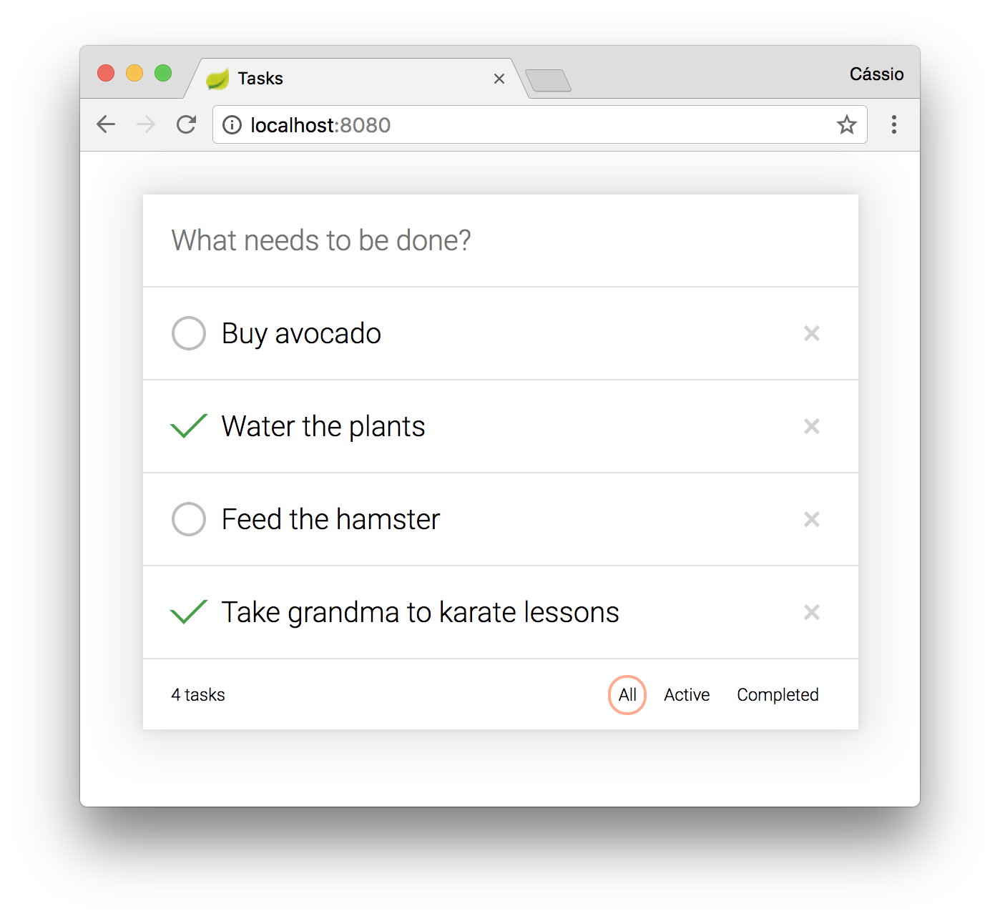

# Sample REST API for managing tasks using Spring Boot and Jersey

[](https://travis-ci.org/cassiomolin/tasks-rest-api)
[](https://raw.githubusercontent.com/cassiomolin/tasks-rest-api/master/LICENSE.txt)

Example of REST API using:

- **Spring Boot:** Framework for creating standalone Java applications.
- **Jersey:** JAX-RS reference implementation for creating RESTful web services in Java.
- **Jackson:** JSON parser for Java.
- **MapStruct:** Mapping framework for Java.
- **Hibernate Validator:** Bean Validation implemetation to define and validate application constraints.
- **REST Assured:** Testing framework for REST APIs.

Besides the REST API, it features a client application built with **Angular** and **TypeScript**. See the [`tasks-client-angular`][client project] project for details.

## Building and running this application

To build and run this application, follow these steps:

1. Open a command line window or terminal.
1. Navigate to the root directory of the project, where the `pom.xml` resides.
1. Compile the project: `mvn clean compile`.
1. Package the application: `mvn package`.
1. Change into the `target` directory: `cd target`
1. You should see a file with the following or a similar name: `tasks-1.0.jar`.
1. Execute the JAR: `java -jar tasks-1.0.jar`.
1. The REST API will be available at `http://localhost:8080/api`.
1. A JavaScript client application will be available at `http://localhost:8080`.

When the application starts up, the database will be populated with some rows. 

## Angular client application

An **Angular** and **TypeScript** client application is shipped with the main application and it's available at `http://localhost:8080`:



For better maintainability, client and server applications source code are kept in different repositories. During the build, the [client application artifacts][client releases] are downloaded, packed and released as part of the main application. 

For the client application source code, refer to the [`tasks-client-angular`][client project] project.

## REST API overview

The application provides a REST API for managing tasks. See the [curl][] scripts below with the supported operations:

### Create a task

```bash
curl -X POST \
  'http://localhost:8080/api/tasks' \
  -H 'Content-Type: application/json' \
  -d '{
  "description": "Pay internet bill"
}'
```
### Get multiple tasks

```bash
curl -X GET \
  'http://localhost:8080/api/tasks' \
  -H 'Accept: application/json'
```

This endpoint supports the following query parameters:

- `description` (string): Filter tasks by description (case-insensitive).
- `completed` (boolean): Filter tasks by completed status.

Filtering tasks by description:

```bash
curl -X GET -G \
  'http://localhost:8080/api/tasks' \
  -H 'Accept: application/json' \
  -d 'description=avocado'
```

Filtering tasks by completed status:

```bash
curl -X GET -G \
  'http://localhost:8080/api/tasks' \
  -H 'Accept: application/json' \
  -d 'completed=true'
```

Filtering tasks by description and by completed status:

```bash
curl -X GET -G \
  'http://localhost:8080/api/tasks' \
  -H 'Accept: application/json' \
  -d 'description=karate' \
  -d 'completed=true'
```

### Get a task by id

```bash
curl -X GET \
  'http://localhost:8080/api/tasks/5' \
  -H 'Accept: application/json'
```

### Update a task

```bash
curl -X PUT \
  'http://localhost:8080/api/tasks/5' \
  -H 'Content-Type: application/json' \
  -d '{
  "description": "Pay electricity bill",
  "completed": false
}'
```

### Update a task completed status

```bash
curl -X PUT \
  'http://localhost:8080/api/tasks/5/completed' \
  -H 'Content-Type: application/json' \
  -d '{
  "value": true
}'
```

### Delete a task by id

```bash
curl -X DELETE \
  'http://localhost:8080/api/tasks/5'
```

### Delete multiple tasks

```bash
curl -X DELETE \
  'http://localhost:8080/api/tasks'
```

This endpoint supports the following query parameter:

- `completed` (boolean): Delete tasks by completed status.

And it can be used as following:

```bash
curl -X DELETE -G \
  'http://localhost:8080/api/tasks' \
  -d 'completed=true'
```

## Targeting the REST API with Postman

Alternatively to [curl][], you can use [Postman][] to target the REST API. The Postman collection files are available in the [`src/main/postman`](src/main/postman) directory.

[Postman]: https://www.getpostman.com/
[client project]: https://github.com/cassiomolin/tasks-client-angular
[client releases]: https://github.com/cassiomolin/tasks-client-angular/releases
[curl]: https://curl.haxx.se/
